# **PptGPT  产品说明**

## **1 软件简介**

PptGPT是一款智能幻灯片生成插件，可以结合个人知识库生成精准匹配答辩、演讲、汇报场景的PPT幻灯片内容及原创配图，也可以通过润色及翻译功能修改优化PPT内容。

## **2 软件安装**

### **2.1软件下载(推荐使用百度云下载，速度稳定)**

[下载地址1](https://www.123pan.com/s/Czz1Td-glxxA.html)  [下载地址2](https://pan.baidu.com/s/1iNtgi479sWEk0ZmUoibqTQ?pwd=NewB)  

适用于Windows系统，推荐使用Win10以上系统及Office2012以上版本，WPS最新版本

苹果电脑macOS系统请见链接：[https://www.nbimgpt.com/Download/OfficeAI-Mac.html](https://www.nbimgpt.com/Download/OfficeAI-Mac.html "https://www.nbimgpt.com/Download/OfficeAI-Mac.html")

### **2.2软件**安装

安装前的准备工作：

(1)关闭Office、WPS相关软件；

(2)部分无管理员权限的电脑建议先临时关闭杀毒软件，安装完成后再开启。

安装步骤：

(1)下载安装包，解压；

(2)双击或右键以管理员身份运行setup.exe安装文件，点击下一步，按默认安装即可

(3)安装完成，打开PowerPoint、WPS即可使用。

### **2.3升级软件**

点击【升级软件】按钮即可自动检查并更新到最新版本。

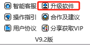

如果有新版本，等待下载完成按向导步骤执行更新安装，安装完成后重新打开PowerPoint或WPS即可。

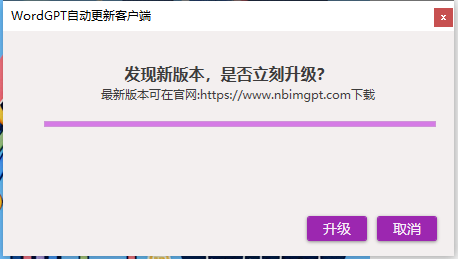

### **2.4软件注册与使用（全套OfficeAI账号通用）**

（1）软件注册、登录：

点击【登录\注册】按钮，进入注册页面，使用手机号进行注册，注册后返回登录。

（2）免费版、基础版、专业版、企业版：

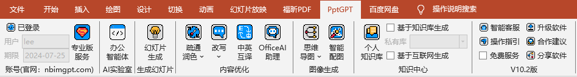

(a)基础版：高质量服务优先支持专业版用户，基础版用户每天按算力情况提供限量免费高质量生成服务；

(b)专业版：所有功能均可无限次数使用及7X8小时办公解决方案客服支持，需要优惠邀请码可关注公众号:OfficeAI办公，发送：邀请码

(c)企业版：企业私有化定制部署：详情可联系客服

(d)免费版：勾选右侧面板中“免费服务”即可不限量使用轻量版服务

<table width="100%"><tbody style="margin: 0px; padding: 0px; outline: 0px; max-width: 100%; box-sizing: border-box !important; overflow-wrap: break-word !important;"><tr style="margin: 0px; padding: 0px; outline: 0px; max-width: 100%; box-sizing: border-box !important; overflow-wrap: break-word !important;" class="firstRow"><td valign="top" style="margin: 0px; outline: 0px; word-break: break-all; hyphens: auto; max-width: 100%; overflow-wrap: break-word !important; box-sizing: border-box !important;"><strong style="margin: 0px; padding: 0px; outline: 0px; max-width: 100%; box-sizing: border-box !important; overflow-wrap: break-word !important;">版本对比</strong></td><td valign="top" style="margin: 0px; outline: 0px; word-break: break-all; hyphens: auto; max-width: 100%; overflow-wrap: break-word !important; box-sizing: border-box !important;"><strong style="margin: 0px; padding: 0px; outline: 0px; max-width: 100%; box-sizing: border-box !important; overflow-wrap: break-word !important;">免费版</strong></td><td valign="top" style="margin: 0px; outline: 0px; word-break: break-all; hyphens: auto; max-width: 100%; overflow-wrap: break-word !important; box-sizing: border-box !important;"><strong style="margin: 0px; padding: 0px; outline: 0px; max-width: 100%; box-sizing: border-box !important; overflow-wrap: break-word !important;">基础版</strong></td><td valign="top" style="margin: 0px; outline: 0px; word-break: break-all; hyphens: auto; max-width: 100%; overflow-wrap: break-word !important; box-sizing: border-box !important;"><strong style="margin: 0px; padding: 0px; outline: 0px; max-width: 100%; box-sizing: border-box !important; overflow-wrap: break-word !important;">专业版</strong></td><td valign="top" style="margin: 0px; outline: 0px; word-break: break-all; hyphens: auto; max-width: 100%; overflow-wrap: break-word !important; box-sizing: border-box !important;"><strong style="margin: 0px; padding: 0px; outline: 0px; max-width: 100%; box-sizing: border-box !important; overflow-wrap: break-word !important;">企业版</strong></td></tr><tr style="margin: 0px; padding: 0px; outline: 0px; max-width: 100%; box-sizing: border-box !important; overflow-wrap: break-word !important;"><td valign="top" style="margin: 0px; outline: 0px; word-break: break-all; hyphens: auto; max-width: 100%; overflow-wrap: break-word !important; box-sizing: border-box !important;">生成质量</td><td valign="top" style="margin: 0px; outline: 0px; word-break: break-all; hyphens: auto; max-width: 100%; overflow-wrap: break-word !important; box-sizing: border-box !important;">一般</td><td valign="top" style="margin: 0px; outline: 0px; word-break: break-all; hyphens: auto; max-width: 100%; overflow-wrap: break-word !important; box-sizing: border-box !important;">高</td><td valign="top" style="margin: 0px; outline: 0px; word-break: break-all; hyphens: auto; max-width: 100%; overflow-wrap: break-word !important; box-sizing: border-box !important;">高</td><td valign="top" style="margin: 0px; outline: 0px; word-break: break-all; hyphens: auto; max-width: 100%; overflow-wrap: break-word !important; box-sizing: border-box !important;">高 </td></tr><tr style="margin: 0px; padding: 0px; outline: 0px; max-width: 100%; box-sizing: border-box !important; overflow-wrap: break-word !important;"><td valign="top" style="margin: 0px; outline: 0px; word-break: break-all; hyphens: auto; max-width: 100%; overflow-wrap: break-word !important; box-sizing: border-box !important;">数据处理</td><td valign="top" style="margin: 0px; outline: 0px; word-break: break-all; hyphens: auto; max-width: 100%; overflow-wrap: break-word !important; box-sizing: border-box !important;">无限次</td><td valign="top" style="margin: 0px; outline: 0px; word-break: break-all; hyphens: auto; max-width: 100%; overflow-wrap: break-word !important; box-sizing: border-box !important;">每日限额</td><td valign="top" style="margin: 0px; outline: 0px; word-break: break-all; hyphens: auto; max-width: 100%; overflow-wrap: break-word !important; box-sizing: border-box !important;">无限次</td><td valign="top" style="margin: 0px; outline: 0px; word-break: break-all; hyphens: auto; max-width: 100%; overflow-wrap: break-word !important; box-sizing: border-box !important;">无限次</td></tr><tr style="margin: 0px; padding: 0px; outline: 0px; max-width: 100%; box-sizing: border-box !important; overflow-wrap: break-word !important;"><td valign="top" style="margin: 0px; outline: 0px; word-break: break-all; hyphens: auto; max-width: 100%; overflow-wrap: break-word !important; box-sizing: border-box !important;">OfficeAI助理</td><td valign="top" style="margin: 0px; outline: 0px; word-break: break-all; hyphens: auto; max-width: 100%; overflow-wrap: break-word !important; box-sizing: border-box !important;">永久免费</td><td valign="top" style="margin: 0px; outline: 0px; word-break: break-all; hyphens: auto; max-width: 100%; overflow-wrap: break-word !important; box-sizing: border-box !important;">永久免费</td><td valign="top" style="margin: 0px; outline: 0px; word-break: break-all; hyphens: auto; max-width: 100%; overflow-wrap: break-word !important; box-sizing: border-box !important;">永久免费</td><td valign="top" style="margin: 0px; outline: 0px; word-break: break-all; hyphens: auto; max-width: 100%; overflow-wrap: break-word !important; box-sizing: border-box !important;">永久免费</td></tr><tr style="margin: 0px; padding: 0px; outline: 0px; max-width: 100%; box-sizing: border-box !important; overflow-wrap: break-word !important;"><td valign="top" style="margin: 0px; outline: 0px; word-break: break-all; hyphens: auto; max-width: 100%; overflow-wrap: break-word !important; box-sizing: border-box !important;">办公智能体</td><td valign="top" style="margin: 0px; outline: 0px; word-break: break-all; hyphens: auto; max-width: 100%; overflow-wrap: break-word !important; box-sizing: border-box !important;">√</td><td valign="top" style="margin: 0px; outline: 0px; word-break: break-all; hyphens: auto; max-width: 100%; overflow-wrap: break-word !important; box-sizing: border-box !important;">√</td><td valign="top" style="margin: 0px; outline: 0px; word-break: break-all; hyphens: auto; max-width: 100%; overflow-wrap: break-word !important; box-sizing: border-box !important;">√</td><td valign="top" style="margin: 0px; outline: 0px; word-break: break-all; hyphens: auto; max-width: 100%; overflow-wrap: break-word !important; box-sizing: border-box !important;">√</td></tr><tr style="margin: 0px; padding: 0px; outline: 0px; max-width: 100%; box-sizing: border-box !important; overflow-wrap: break-word !important;"><td valign="top" style="margin: 0px; outline: 0px; word-break: break-all; hyphens: auto; max-width: 100%; overflow-wrap: break-word !important; box-sizing: border-box !important;">思维导图</td><td valign="top" style="margin: 0px; outline: 0px; word-break: break-all; hyphens: auto; max-width: 100%; overflow-wrap: break-word !important; box-sizing: border-box !important;">X</td><td valign="top" style="margin: 0px; outline: 0px; word-break: break-all; hyphens: auto; max-width: 100%; overflow-wrap: break-word !important; box-sizing: border-box !important;">√</td><td valign="top" style="margin: 0px; outline: 0px; word-break: break-all; hyphens: auto; max-width: 100%; overflow-wrap: break-word !important; box-sizing: border-box !important;">√</td><td valign="top" style="margin: 0px; outline: 0px; word-break: break-all; hyphens: auto; max-width: 100%; overflow-wrap: break-word !important; box-sizing: border-box !important;">√</td></tr><tr style="margin: 0px; padding: 0px; outline: 0px; max-width: 100%; box-sizing: border-box !important; overflow-wrap: break-word !important;"><td valign="top" style="margin: 0px; outline: 0px; word-break: break-all; hyphens: auto; max-width: 100%; overflow-wrap: break-word !important; box-sizing: border-box !important;">便捷功能</td><td valign="top" style="margin: 0px; outline: 0px; word-break: break-all; hyphens: auto; max-width: 100%; overflow-wrap: break-word !important; box-sizing: border-box !important;">√</td><td valign="top" style="margin: 0px; outline: 0px; word-break: break-all; hyphens: auto; max-width: 100%; overflow-wrap: break-word !important; box-sizing: border-box !important;">√</td><td valign="top" style="margin: 0px; outline: 0px; word-break: break-all; hyphens: auto; max-width: 100%; overflow-wrap: break-word !important; box-sizing: border-box !important;">√</td><td valign="top" style="margin: 0px; outline: 0px; word-break: break-all; hyphens: auto; max-width: 100%; overflow-wrap: break-word !important; box-sizing: border-box !important;">√</td></tr><tr style="margin: 0px; padding: 0px; outline: 0px; max-width: 100%; box-sizing: border-box !important; overflow-wrap: break-word !important;"><td valign="top" style="margin: 0px; outline: 0px; word-break: break-all; hyphens: auto; max-width: 100%; overflow-wrap: break-word !important; box-sizing: border-box !important;">适用人群及场景</td><td valign="top" style="margin: 0px; outline: 0px; word-break: break-all; hyphens: auto; max-width: 100%; overflow-wrap: break-word !important; box-sizing: border-box !important;">个人日常使用</td><td valign="top" style="margin: 0px; outline: 0px; word-break: break-all; hyphens: auto; max-width: 100%; overflow-wrap: break-word !important; box-sizing: border-box !important;">所有人群,科研、办公等场景</td><td valign="top" style="margin: 0px; outline: 0px; word-break: break-all; hyphens: auto; max-width: 100%; overflow-wrap: break-word !important; box-sizing: border-box !important;">所有人群,科研办公等场景</td><td valign="top" style="margin: 0px; outline: 0px; word-break: break-all; hyphens: auto; max-width: 100%; overflow-wrap: break-word !important; box-sizing: border-box !important;">超过30人的企业</td></tr><tr style="margin: 0px; padding: 0px; outline: 0px; max-width: 100%; box-sizing: border-box !important; overflow-wrap: break-word !important;"><td valign="top" style="margin: 0px; outline: 0px; word-break: break-all; hyphens: auto; max-width: 100%; overflow-wrap: break-word !important; box-sizing: border-box !important;">费用</td><td valign="top" style="margin: 0px; outline: 0px; word-break: break-all; hyphens: auto; max-width: 100%; overflow-wrap: break-word !important; box-sizing: border-box !important;">免费</td><td valign="top" style="margin: 0px; outline: 0px; word-break: break-all; hyphens: auto; max-width: 100%; overflow-wrap: break-word !important; box-sizing: border-box !important;">免费</td><td valign="top" style="margin: 0px; outline: 0px; word-break: break-all; hyphens: auto; max-width: 100%; overflow-wrap: break-word !important; box-sizing: border-box !important;">0.6-0.9元每天</td><td valign="top" style="margin: 0px; outline: 0px; word-break: break-all; hyphens: auto; max-width: 100%; overflow-wrap: break-word !important; box-sizing: border-box !important;">根据需求定制</td></tr></tbody></table>

注：如使用期限未同步更新，可关闭PowerPoint/WPS后重新打开

## **3 软件使用**

**生成数据源选择**

如果对生成的内容有较高专业性和时效性要求，可以使用知识库或互联网的数据源生成。

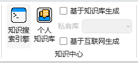

（a）勾选【基于知识库生成】并选择**上传了相关知识文档**的知识库后，可复用已有知识文档重新组织语言进行内容生成。KHub知识库更多信息可查阅以下文章：https://www.nbimgpt.com/contents/22/4308.html

（b）勾选【基于互联网生成】可以实时检索互联网的最新动态生成具有时效性的内容

（c）边搜边写，使用【知识搜索引擎】功能，极大地提升从找资料到写文档过程的工作效率。

操作步骤可查阅以下视频：[https://www.bilibili.com/video/BV1Vm42157Qj/](https://www.bilibili.com/video/BV1Vm42157Qj/ "https://www.bilibili.com/video/BV1Vm42157Qj/")

### **3.1生成幻灯片**

点击【幻灯片生成】按钮，可进入幻灯片生成设置。

（1）设置生成基本参数，下拉框里面没有的选项可以在文本框中手动输入。

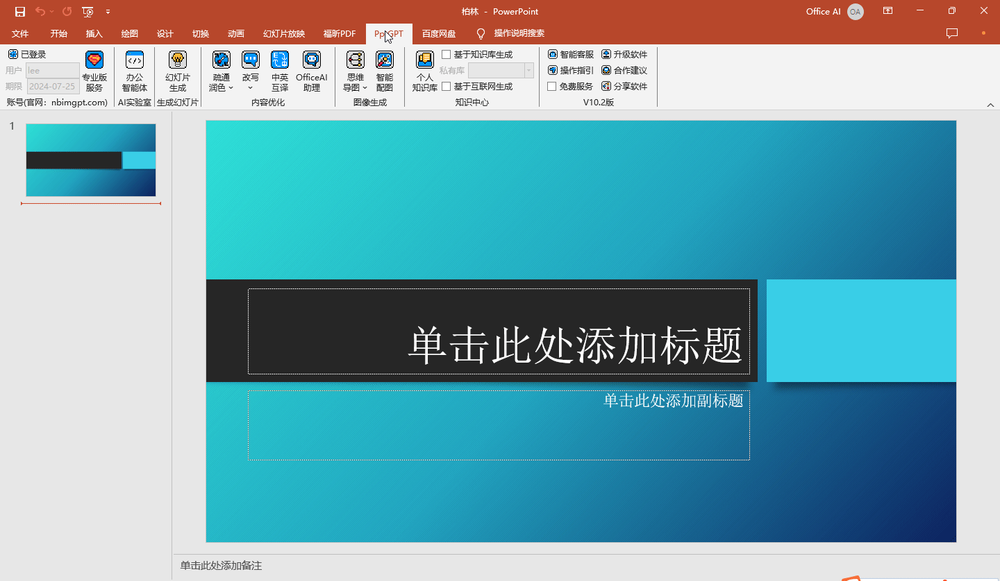

（2）输入幻灯片主题点击【生成方案】按钮，自动生成幻灯片演示方案，生成后可自定义编辑调整，如果对生成的提纲不满意也可以重新生成。

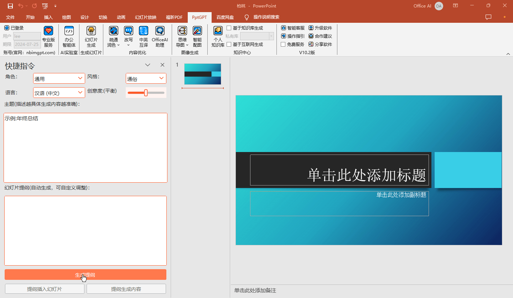

（3）应用提纲插入当前自己的幻灯片模板或基于提纲自动生成带主题及内容的演讲稿。

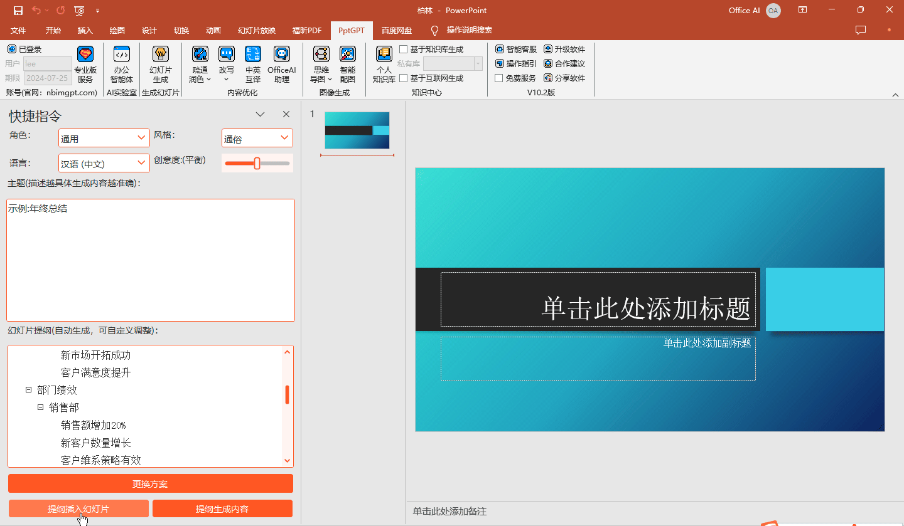

### **3.2润色**

选择需要改写润色的文本内容，按照默认选择不同模式（精确、平衡、创新）的【疏通润色】功能，自动优化润色改写当前选中文本内容。

注：从精确方案到创新方案，生成方案从聚焦到发散，内容呈现上逐步丰富。可以根据创作需求选择生成的模式。

### **3.3改写**

（1）扩写

选需要扩写的短语点击【扩写】按钮可将选中文本进行扩写

（2）缩写

选中需要缩写的段落点击【缩写】按钮按钮可在不改变原意的情况下将段落进行缩写。

### **3.4中英互译**

将选中文本的内容进行中英文转换。

### **3.5思维导图**

选中关键词，点击【思维导图】，自动生成总结型或头脑风暴预测型思维导图

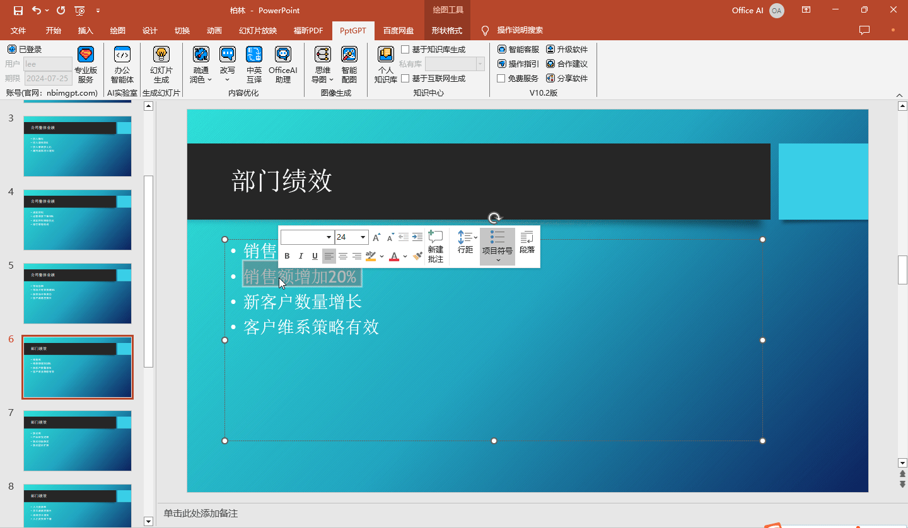

### **3.6智能配图**

选中关键字或短语点击【智能配图】按钮，自动生成原创幻灯片配图。

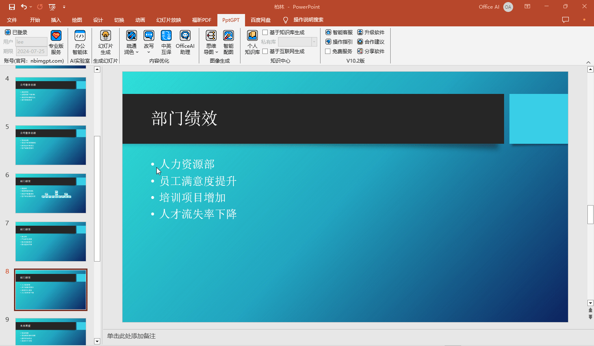

### **3.7O****fficeAI助****理**

OfficeAI助理是一个完全免费的智能对话机器人，擅长通过自然语言连续对话的形式处理解决文本及数据，如知识问答、语言翻译、生成各类文案、总结摘要、生成测试数据、数据分析等。

OfficeAI助理会自动登录当前插件登录的账号，如遇到无法登录的情况，可手动进行登录。

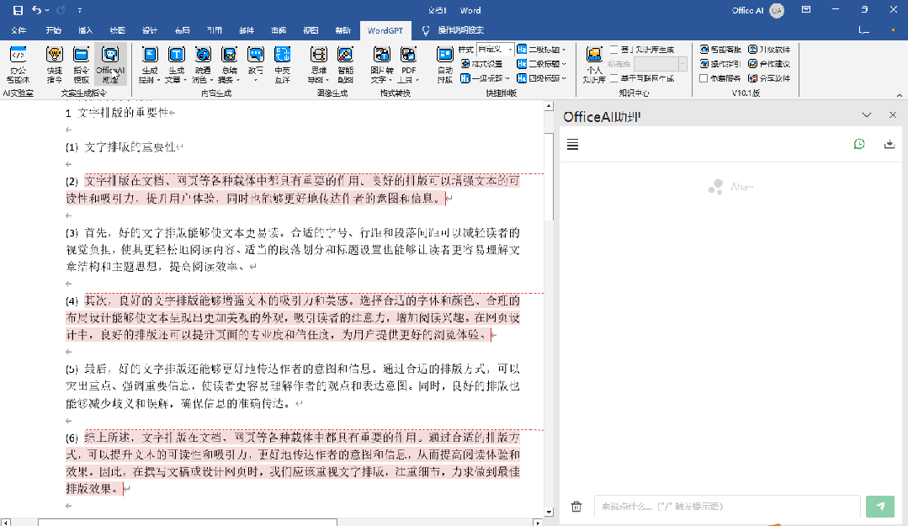

更多知识库相关文档可查阅以下文章：https://www.nbimgpt.com/contents/22/4311.html

### ****3.8办公智能体****

办公智能体是一个适配各种工作场景的智能助手，可以检索文件、生成各种图表、思维导图及知识图谱，还能辅助编辑表格。智能体的能力每月更新，可按3.4的方式每月更新智能体能力。

基本操作：

命令行中输入/调用快捷指令

输入@调用知识库

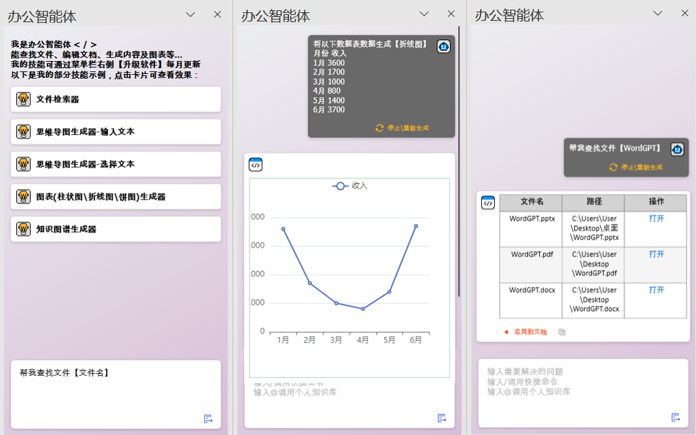

### **3.9帮助**

（1）智能客服：

日常问题可7×24小时通过智能客服自助解决，如果智能客服不能解决的问题可以点击【合作建议】按钮与我们联系

（2）操作指引：

打开软件操作说明书文档

（3）合作建议：

使用过程中有任何需求或建议欢迎反馈给我们

（4）分享软件：

将PptGPT插件分享给您的好友

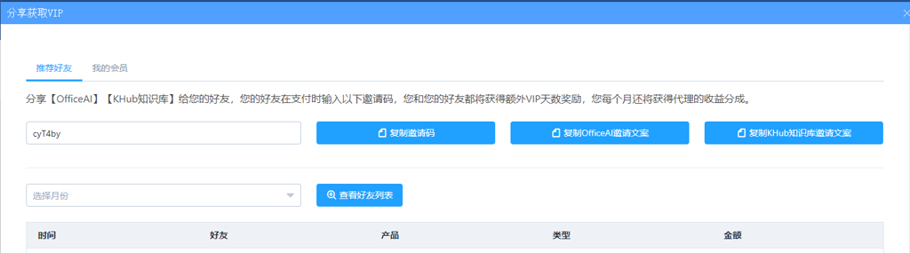

## **4 软件卸载**

**请按推荐方式进行卸载。**

可通过控制面板->卸载程序->OfficeAI办公智能体，或设置->应用->应用和功能->OfficeAI办公智能体，右键卸载。

## **5 其他问题**

可微信联系

